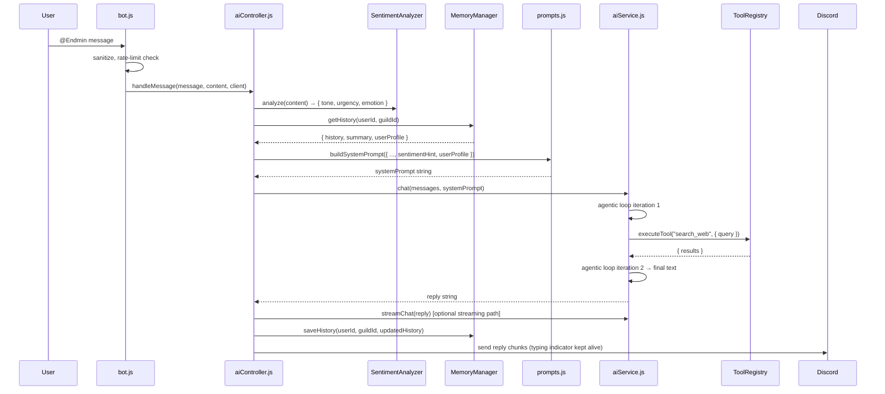
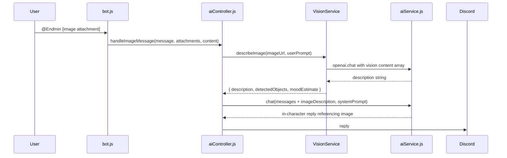
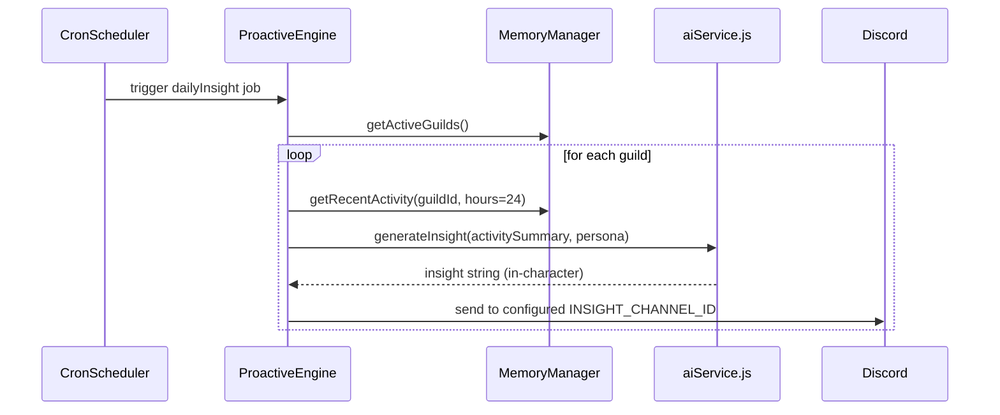

# Design Document: AI Feature Maximization — pengmin-bot (Endministrator)

## Overview

This document defines the expanded AI architecture for the Endministrator Discord bot. The current system provides GPT-backed conversation with four tools, guild-scoped memory, and basic summarization. This expansion maximizes every dimension of the AI pipeline: richer tooling, smarter multi-tier memory, proactive event-driven behaviors, multi-modal input (image understanding), per-user personality adaptation, AI-driven moderation, sentiment and emotional intelligence, streaming responses, and skill chaining. All additions are designed to slot into the existing layered architecture without restructuring `bot.js` or the command auto-loader.

The guiding philosophy is "the Protocol Network grows deeper." Each new capability makes the Endministrator feel more omniscient, more contextually aware, and more alive — while keeping the stoic, analytical character intact. Every AI expansion is framed as a new intelligence protocol the Endministrator has activated after a dormancy cycle.

---

## Architecture

The expanded system adds three new layers alongside the existing pipeline: a **Proactive Engine** (scheduled and event-driven AI actions), an **Intelligence Layer** (sentiment, moderation, image understanding), and a **Skill Chain Executor** (multi-step tool composition). These integrate at the `aiController.js` orchestration level and publish to a shared internal event bus.

```mermaid
graph TD
    subgraph Discord Gateway
        MSG[messageCreate] --> BOT[bot.js]
        REACTION[reactionAdd/Remove] --> BOT
        MEMBER[guildMemberAdd/Update] --> BOT
        IMG[Attachment on message] --> BOT
    end

    subgraph Orchestration — aiController.js
        BOT --> CTRL[handleMessage]
        BOT --> IMGCTRL[handleImageMessage]
        BOT --> PROACTIVE[ProactiveEngine]
    end

    subgraph Memory Layer — memoryManager.js
        CTRL --> MEM[TieredMemoryManager]
        MEM --> HOT[Hot Cache — in-process Map]
        MEM --> WARM[Warm Cache — summarized episodes]
        MEM --> COLD[Cold Storage — PostgreSQL]
        MEM --> PROFILE[UserProfileStore — personality vectors]
    end

    subgraph AI Service — aiService.js
        CTRL --> CHAT[chat — agentic loop]
        CHAT --> STREAM[streamChat — SSE streaming]
        CHAT --> CHAIN[SkillChainExecutor]
        CHAIN --> TOOLS[ToolRegistry]
    end

    subgraph ToolRegistry — tools.js
        TOOLS --> T1[get_current_time]
        TOOLS --> T2[get_latest_news]
        TOOLS --> T3[search_web]
        TOOLS --> T4[get_gif]
        TOOLS --> T5[analyze_image]
        TOOLS --> T6[read_code_snippet]
        TOOLS --> T7[get_weather]
        TOOLS --> T8[translate_text]
        TOOLS --> T9[create_poll]
        TOOLS --> T10[get_server_stats]
        TOOLS --> T11[recall_user_facts]
        TOOLS --> T12[summarize_channel]
    end

    subgraph Intelligence Layer
        IMGCTRL --> VISION[VisionService — GPT-4o Vision]
        CTRL --> SENTIMENT[SentimentAnalyzer]
        CTRL --> MODERATION[ModerationService — OpenAI + heuristics]
    end

    subgraph Proactive Engine
        PROACTIVE --> SCHEDULER[CronScheduler — node-cron or setInterval]
        PROACTIVE --> EVENTBUS[InternalEventBus — EventEmitter]
        SCHEDULER --> INSIGHT[DailyInsightJob]
        EVENTBUS --> WELCOME[MemberWelcomeFlow]
        EVENTBUS --> MILESTONE[MilestoneTracker]
    end

    subgraph Prompt Layer — prompts.js
        CTRL --> PROMPT[buildSystemPrompt]
        PROFILE --> PROMPT
        SENTIMENT --> PROMPT
    end
```

---

## Sequence Diagrams

### Standard Message with Full Pipeline



### Image Analysis Flow



### Proactive Daily Insight



---

## Components and Interfaces

### Component 1: ToolRegistry (enhanced `src/ai/tools.js`)

**Purpose**: Central registry for all AI tools. Supports dynamic registration so new tools can be added without modifying the switch statement.

**Interface**:
```javascript
// Tool registration
ToolRegistry.register(definition, executor)

// Tool execution
async ToolRegistry.execute(name, args)  // returns tool result object

// Get all definitions for OpenAI
ToolRegistry.getDefinitions()           // returns TOOL_DEFINITIONS array
```

**Responsibilities**:
- Hold all OpenAI function-calling definitions
- Dispatch execution by name
- Wrap all errors into structured `{ error }` objects so the model handles them gracefully
- Support lazy-loaded executors (tools that import heavy modules only when called)

---

### Component 2: SkillChainExecutor (`src/ai/skillChain.js`)

**Purpose**: Allows the AI to compose multiple tools into a sequential or branching pipeline within a single user turn. Useful for "research → summarize → respond" flows.

**Interface**:
```javascript
// Execute a named skill chain
async SkillChainExecutor.execute(chainName, initialArgs, context)
// Returns: { result, steps: [{ tool, args, output }] }

// Register a static chain definition
SkillChainExecutor.define(chainName, steps)
// steps: [{ tool, argsMapper }] where argsMapper receives previous step output
```

**Responsibilities**:
- Sequence tool calls where output feeds next tool's input
- Cap chain depth at `MAX_CHAIN_DEPTH` (default 5)
- Log each step for debugging
- Return full step trace so `aiService.js` can inject it as tool context

---

### Component 3: SentimentAnalyzer (`src/ai/sentimentAnalyzer.js`)

**Purpose**: Lightweight in-process sentiment analysis using heuristic scoring plus an optional lightweight model call. Produces a structured hint injected into the system prompt.

**Interface**:
```javascript
// Analyze a message string
SentimentAnalyzer.analyze(text)
// Returns: { tone: 'positive'|'neutral'|'negative'|'distressed', urgency: 0..1, primaryEmotion: string }

// Batch analyze recent history
SentimentAnalyzer.analyzeHistory(messages)
// Returns: { trend: string, dominantEmotion: string }
```

**Responsibilities**:
- Score text against keyword dictionaries (no external API needed for basic analysis)
- Detect urgency signals ("help", "please", distress language)
- Return structured hints that `prompts.js` can embed as a soft behavioral modifier

---

### Component 4: VisionService (`src/ai/visionService.js`)

**Purpose**: Handles image analysis via GPT-4o's vision capability. Extracts description and metadata from image attachments.

**Interface**:
```javascript
// Analyze an image URL
async VisionService.describeImage(imageUrl, userPrompt)
// Returns: { description: string, detectedObjects: string[], estimatedMood: string, safeForWork: boolean }

// Check if a message has analyzable attachments
VisionService.hasImages(message)
// Returns: boolean
```

**Responsibilities**:
- Validate attachment URLs through `isSafeUrl()` before passing to API
- Build vision-format content array: `[{ type: 'image_url', image_url: { url } }, { type: 'text', text: prompt }]`
- Enforce a `MAX_IMAGE_SIZE_MB` guard (default 10 MB) — reject oversized images before API call
- Return `safeForWork: false` if OpenAI moderation flags the image

---

### Component 5: UserProfileStore (`src/memory/userProfileStore.js`)

**Purpose**: Persists a lightweight per-user personality profile — interaction count, preferred response style, notable topics, and emotional history. Feeds into prompt personalization.

**Interface**:
```javascript
// Load or create a profile
async UserProfileStore.get(userId, guildId)
// Returns: UserProfile object

// Update profile after an interaction
async UserProfileStore.update(userId, guildId, delta)
// delta: partial UserProfile — merged with existing

// Extract facts the AI noted about this user
async UserProfileStore.getUserFacts(userId, guildId)
// Returns: string[] of notable facts
```

**UserProfile shape**:
```javascript
{
  userId: string,
  guildId: string,
  interactionCount: number,
  topicsOfInterest: string[],     // extracted by AI during summarization
  preferredTone: string,          // 'brief' | 'detailed' | 'casual' | 'technical'
  notableFacts: string[],         // memorable facts AI noted (name, role, projects)
  sentimentHistory: string[],     // last 5 tone assessments
  lastSeen: ISO string,
  createdAt: ISO string
}
```

---

### Component 6: ModerationService (`src/ai/moderationService.js`)

**Purpose**: Pre-flight content moderation using OpenAI's Moderation API plus local heuristics. Runs before the AI processes any message.

**Interface**:
```javascript
// Check a message
async ModerationService.check(content)
// Returns: { safe: boolean, categories: string[], action: 'allow'|'warn'|'block' }

// Log a moderation event
ModerationService.logEvent(userId, guildId, content, result)
```

**Responsibilities**:
- Call `openai.moderations.create()` for content flagging
- Apply local blocklist patterns as a fast pre-check
- Determine action: `allow` (proceed normally), `warn` (AI handles gracefully), `block` (reply with in-character refusal)
- Never expose moderation reasoning to the user — the Endministrator simply "does not engage with that signal"

---

### Component 7: ProactiveEngine (`src/ai/proactiveEngine.js`)

**Purpose**: Generates AI-driven, unprompted messages on schedule or in response to guild events (member join, milestone reached, long silence).

**Interface**:
```javascript
// Initialize with the Discord client
ProactiveEngine.init(client)

// Manually trigger a specific behavior
async ProactiveEngine.trigger(behaviorName, guildId, channelId, context)

// Register a new behavior
ProactiveEngine.registerBehavior(name, handler)
```

**Built-in behaviors**:
- `dailyInsight` — scheduled digest of recent server activity, framed as Protocol Network analysis
- `memberWelcome` — personalized in-character welcome when a member joins
- `silenceBreaker` — after configurable hours of silence in a channel, post a cryptic observation
- `milestone` — detect message count / member count milestones and acknowledge them in-character

---

### Component 8: StreamingResponder (`src/ai/streamingResponder.js`)

**Purpose**: Streams GPT completions to Discord using progressive message edits, giving the impression of real-time "transmission."

**Interface**:
```javascript
// Send a streaming response
async StreamingResponder.send(message, streamGenerator)
// streamGenerator: AsyncGenerator yielding text deltas

// Check if streaming is appropriate (short responses skip it)
StreamingResponder.shouldStream(estimatedLength)
// Returns: boolean
```

**Responsibilities**:
- Send initial "receiving transmission…" message
- Accumulate deltas and edit the message every `STREAM_EDIT_INTERVAL_MS` (default 800ms) to avoid Discord rate limits
- Finalize with the complete message
- Fall back to standard `message.reply()` if stream fails mid-way

---

## Data Models

### UserProfile

```javascript
// src/memory/userProfileStore.js
{
  userId: string,               // Discord user ID
  guildId: string,              // Discord guild ID
  interactionCount: number,     // total messages exchanged
  topicsOfInterest: string[],   // up to 10 topics extracted from history
  preferredTone: string,        // 'brief' | 'detailed' | 'casual' | 'technical'
  notableFacts: string[],       // up to 20 AI-noted facts
  sentimentHistory: string[],   // last 5 tone labels
  lastSeen: string,             // ISO 8601
  createdAt: string             // ISO 8601
}
```

**Validation Rules**:
- `topicsOfInterest` capped at 10 entries; oldest dropped when full
- `notableFacts` capped at 20 entries
- `sentimentHistory` capped at 5, always prepend newest

---

### SentimentResult

```javascript
{
  tone: 'positive' | 'neutral' | 'negative' | 'distressed',
  urgency: number,           // 0.0 – 1.0
  primaryEmotion: string,    // e.g. 'curious', 'frustrated', 'excited'
  confidence: number         // 0.0 – 1.0 (heuristic estimate)
}
```

---

### ModerationResult

```javascript
{
  safe: boolean,
  categories: string[],       // OpenAI moderation category names that flagged
  scores: Record<string, number>,
  action: 'allow' | 'warn' | 'block',
  source: 'openai' | 'local'  // which check triggered it
}
```

---

### SkillChainDefinition

```javascript
{
  name: string,
  description: string,
  steps: [
    {
      tool: string,                         // tool name
      argsMapper: function(prevOutput, initialArgs)  // produces this step's args
    }
  ],
  maxDepth: number   // override global MAX_CHAIN_DEPTH
}
```

---

### ProactiveBehaviorConfig (per guild, stored in DB or env)

```javascript
{
  guildId: string,
  behaviors: {
    dailyInsight: {
      enabled: boolean,
      channelId: string,
      cronExpression: string   // default: '0 9 * * *' (9 AM daily)
    },
    memberWelcome: {
      enabled: boolean,
      channelId: string        // welcome channel ID
    },
    silenceBreaker: {
      enabled: boolean,
      channelId: string,
      thresholdHours: number   // default: 12
    }
  }
}
```

---

## Algorithmic Pseudocode

### Enhanced Agentic Loop with Skill Chains

```pascal
ALGORITHM chat(messages, systemPrompt, options)
INPUT:
  messages      — array of { role, content } objects
  systemPrompt  — system prompt string
  options       — { streaming: bool, useChains: bool }
OUTPUT: reply string

BEGIN
  fullMessages ← [ { role: 'system', content: systemPrompt }, ...messages ]
  iterations   ← 0
  chainResults ← []

  WHILE iterations < MAX_TOOL_ITERATIONS DO
    iterations ← iterations + 1

    response ← openai.chat.completions.create({
      model:       AI_CONFIG.model,
      messages:    fullMessages,
      tools:       ToolRegistry.getDefinitions(),
      tool_choice: 'auto'
    })

    choice      ← response.choices[0]
    assistantMsg ← choice.message
    fullMessages.push(assistantMsg)

    IF choice.finish_reason = 'tool_calls' THEN
      toolResults ← []

      FOR EACH toolCall IN assistantMsg.tool_calls DO
        args ← JSON.parse(toolCall.function.arguments)

        // Check if this is a chain-eligible tool invocation
        IF options.useChains AND SkillChainExecutor.hasChain(toolCall.function.name) THEN
          result ← AWAIT SkillChainExecutor.execute(toolCall.function.name, args)
          chainResults.push(result.steps)
        ELSE
          result ← AWAIT ToolRegistry.execute(toolCall.function.name, args)
        END IF

        toolResults.push({
          role:        'tool',
          tool_call_id: toolCall.id,
          content:     JSON.stringify(result)
        })
      END FOR

      fullMessages.push(...toolResults)
      CONTINUE

    END IF

    // Normal text response
    text ← assistantMsg.content.trim()

    IF text IS NOT EMPTY THEN
      IF options.streaming THEN
        RETURN streamingResponder.send(message, text)
      ELSE
        RETURN text
      END IF
    END IF

  END WHILE

  RETURN '`*Processing limit reached. Stand by.*`'
END
```

---

### Tiered Memory Retrieval with Profile Injection

```pascal
ALGORITHM getEnrichedContext(userId, guildId)
INPUT:  userId, guildId — string identifiers
OUTPUT: { history, summary, userProfile, sentimentTrend }

BEGIN
  key ← userId + ':' + guildId

  // Tier 1: Hot cache
  IF hotCache.has(key) AND NOT hotCache.isStale(key) THEN
    record ← hotCache.get(key)
  ELSE IF db.isEnabled() THEN
    // Tier 2: Cold storage
    record ← AWAIT db.loadHistory(userId, guildId)
    hotCache.set(key, record)
  ELSE
    record ← { history: [], summary: '' }
    hotCache.set(key, record)
  END IF

  // Load user profile separately (lightweight table)
  userProfile ← AWAIT UserProfileStore.get(userId, guildId)

  // Compute sentiment trend from recent history
  sentimentTrend ← SentimentAnalyzer.analyzeHistory(record.history.slice(-5))

  RETURN {
    history:       record.history,
    summary:       record.summary,
    userProfile:   userProfile,
    sentimentTrend: sentimentTrend
  }
END
```

---

### Sentiment Analysis (Heuristic)

```pascal
ALGORITHM analyzeSentiment(text)
INPUT:  text — string
OUTPUT: SentimentResult

BEGIN
  lowerText ← text.toLowerCase()
  score     ← 0
  urgency   ← 0.0
  emotion   ← 'neutral'

  // Score positive signals
  FOR EACH word IN POSITIVE_KEYWORDS DO
    IF lowerText.includes(word) THEN score ← score + 1 END IF
  END FOR

  // Score negative signals
  FOR EACH word IN NEGATIVE_KEYWORDS DO
    IF lowerText.includes(word) THEN score ← score - 1 END IF
  END FOR

  // Detect urgency signals
  FOR EACH pattern IN URGENCY_PATTERNS DO
    IF pattern.test(lowerText) THEN
      urgency ← MIN(urgency + 0.3, 1.0)
    END IF
  END FOR

  // Classify distress (overrides tone classification)
  IF urgency >= 0.7 AND score < 0 THEN
    RETURN { tone: 'distressed', urgency, primaryEmotion: 'distressed', confidence: 0.8 }
  END IF

  IF score > 1 THEN    tone ← 'positive'
  ELSE IF score < -1 THEN tone ← 'negative'
  ELSE                  tone ← 'neutral'
  END IF

  // Dominant emotion mapping (simple keyword match)
  emotion ← detectPrimaryEmotion(lowerText)

  RETURN {
    tone:           tone,
    urgency:        urgency,
    primaryEmotion: emotion,
    confidence:     0.6       // heuristic confidence
  }
END
```

---

### Proactive Engine — Daily Insight Job

```pascal
ALGORITHM runDailyInsight(client)
INPUT:  client — Discord.js Client
OUTPUT: void (sends messages to channels as side effect)

BEGIN
  activeGuilds ← AWAIT db.getGuildsWithProactiveBehavior('dailyInsight')

  FOR EACH guild IN activeGuilds DO
    config  ← guild.behaviors.dailyInsight
    channel ← AWAIT client.channels.fetch(config.channelId)

    IF channel IS NULL THEN CONTINUE END IF

    // Gather last 24h of activity stats
    stats ← AWAIT gatherActivityStats(guild.id, hours=24)

    // Build a minimal prompt for in-character insight
    insightPrompt ← buildInsightPrompt(stats, persona)

    insight ← AWAIT aiService.chat(
      [{ role: 'user', content: insightPrompt }],
      insightSystemPrompt
    )

    AWAIT channel.send(insight)
    logger.info('Daily insight sent for guild: ' + guild.id)
  END FOR
END
```

---

### Skill Chain Execution

```pascal
ALGORITHM executeChain(chainName, initialArgs, context)
INPUT:
  chainName   — registered chain identifier
  initialArgs — initial input arguments
  context     — { userId, guildId, message }
OUTPUT: { result, steps: [{tool, args, output}] }

BEGIN
  chain ← SkillChainExecutor.chains.get(chainName)

  IF chain IS NULL THEN
    RETURN { error: 'Unknown chain: ' + chainName }
  END IF

  steps       ← []
  currentArgs ← initialArgs
  prevOutput  ← NULL

  FOR EACH step IN chain.steps DO
    IF steps.length >= chain.maxDepth THEN
      BREAK
    END IF

    mappedArgs ← step.argsMapper(prevOutput, currentArgs)
    output     ← AWAIT ToolRegistry.execute(step.tool, mappedArgs)

    steps.push({ tool: step.tool, args: mappedArgs, output })

    IF output.error IS NOT NULL THEN
      // Chain short-circuits on tool error
      RETURN { result: output, steps }
    END IF

    prevOutput ← output
  END FOR

  RETURN { result: prevOutput, steps }
END
```

---

## Key Functions with Formal Specifications

### `handleMessage(message, content, client)` — enhanced in `aiController.js`

```javascript
async function handleMessage(message, content, client)
```

**Preconditions:**
- `message` is a valid discord.js `Message` object with `author`, `channel`, `guildId`
- `content` has already been sanitized by `sanitizeInput()`
- `client` is a logged-in, ready Discord Client

**Postconditions:**
- A reply is sent to `message.channel` in all cases (success or error)
- `memoryManager.saveHistory()` is called exactly once per invocation with the updated conversation
- `UserProfileStore.update()` is called to increment `interactionCount`
- If moderation returns `action: 'block'`, no AI call is made and an in-character refusal is sent
- The typing indicator is cleared in the `finally` block regardless of outcome

**Loop Invariants (agentic tool loop):**
- `fullMessages` array grows monotonically — no messages are removed within a turn
- `iterations` increments by 1 per loop cycle and never exceeds `maxToolIterations`

---

### `analyze(text)` — in `SentimentAnalyzer`

```javascript
function analyze(text)
```

**Preconditions:**
- `text` is a non-null string (may be empty)

**Postconditions:**
- Returns a valid `SentimentResult` with all four fields populated
- `urgency` is in range `[0.0, 1.0]`
- `tone` is exactly one of: `'positive'`, `'neutral'`, `'negative'`, `'distressed'`
- Empty input returns `{ tone: 'neutral', urgency: 0, primaryEmotion: 'neutral', confidence: 0 }`
- No mutations to `text` parameter

---

### `describeImage(imageUrl, userPrompt)` — in `VisionService`

```javascript
async function describeImage(imageUrl, userPrompt)
```

**Preconditions:**
- `imageUrl` passes `isSafeUrl()` check
- Image size is below `MAX_IMAGE_SIZE_MB`
- OpenAI API key is configured and the model supports vision (GPT-4o or GPT-4-vision)

**Postconditions:**
- Returns `{ description, detectedObjects, estimatedMood, safeForWork }` on success
- Returns `{ error }` if URL fails safety check, size check, or API call fails
- Never throws — all errors are caught and returned as `{ error }` objects
- `safeForWork` is `false` if OpenAI's moderation API flags the image

---

### `execute(chainName, initialArgs, context)` — in `SkillChainExecutor`

```javascript
async function execute(chainName, initialArgs, context)
```

**Preconditions:**
- `chainName` is registered via `SkillChainExecutor.define()`
- `initialArgs` is a plain object (not null)

**Postconditions:**
- Returns `{ result, steps }` where `steps.length <= chain.maxDepth`
- Each `steps[i].tool` is a valid registered tool name
- If any step returns `{ error }`, the chain stops and returns immediately with partial steps
- Total wall-clock time does not exceed `CHAIN_TIMEOUT_MS` (default 15s); a timeout returns `{ error: 'chain timeout', steps }`

---

### `send(message, streamGenerator)` — in `StreamingResponder`

```javascript
async function send(message, streamGenerator)
```

**Preconditions:**
- `message` has `reply()` and `channel.send()` available
- `streamGenerator` is an `AsyncGenerator` yielding string deltas

**Postconditions:**
- Exactly one Discord message is created (the initial placeholder), then edited in place
- The final edit contains the complete accumulated text
- If an edit fails (Discord rate limit, message deleted), the function catches the error and sends the complete text as a new `message.reply()`
- The typing indicator is NOT managed here — caller (`aiController.js`) handles it

---

## Example Usage

### New Tool Registration

```javascript
// src/ai/tools.js — adding get_weather tool
const { ToolRegistry } = require('./toolRegistry');

ToolRegistry.register(
  {
    type: 'function',
    function: {
      name: 'get_weather',
      description: 'Gets current weather for a city. Use when user asks about weather conditions.',
      parameters: {
        type: 'object',
        properties: {
          city: { type: 'string', description: 'City name' },
          units: { type: 'string', enum: ['celsius', 'fahrenheit'], description: 'Temperature units' }
        },
        required: ['city']
      }
    }
  },
  async (args) => {
    // executor implementation
    const res = await fetch(`https://api.openweathermap.org/data/2.5/weather?q=${encodeURIComponent(args.city)}&appid=${process.env.WEATHER_API_KEY}`);
    const data = await res.json();
    return { city: data.name, temp: data.main.temp, description: data.weather[0].description };
  }
);
```

---

### Skill Chain: "Research and Summarize"

```javascript
// src/ai/skillChains.js — pre-defined chains
const { SkillChainExecutor } = require('./skillChain');

SkillChainExecutor.define('research_and_summarize', {
  description: 'Search the web then produce a condensed brief',
  steps: [
    {
      tool: 'search_web',
      argsMapper: (prev, initial) => ({ query: initial.query })
    },
    {
      tool: 'summarize_content',
      argsMapper: (prev, initial) => ({
        content: prev.results.map(r => r.content).join('\n\n'),
        maxPoints: 5
      })
    }
  ],
  maxDepth: 3
});
```

---

### Sentiment-Aware Prompt Injection

```javascript
// src/ai/prompts.js — extended buildSystemPrompt
function buildSystemPrompt({ ..., sentimentHint, userProfile } = {}) {
  const parts = [ /* ... existing sections ... */ ];

  if (sentimentHint && sentimentHint.tone === 'distressed') {
    parts.push(
      '## OPERATOR SIGNAL\n' +
      'Detected elevated distress in the current operator signal. ' +
      'Maintain composure. Respond with measured clarity. ' +
      'Do not dismiss the signal — acknowledge it through precision, not warmth.'
    );
    parts.push('');
  }

  if (userProfile && userProfile.interactionCount > 50) {
    parts.push(
      `## OPERATOR PROFILE\n` +
      `Known operator. ${userProfile.interactionCount} recorded interactions. ` +
      `Notable interests: ${userProfile.topicsOfInterest.slice(0, 3).join(', ')}. ` +
      `Preferred signal depth: ${userProfile.preferredTone}.`
    );
    parts.push('');
  }

  return parts.join('\n').trim();
}
```

---

### Image-Aware Message Handling

```javascript
// src/ai/aiController.js — extended handleMessage
async function handleMessage(message, content, client) {
  const hasImages = VisionService.hasImages(message);

  if (hasImages) {
    return handleImageMessage(message, content, client);
  }

  // ... existing flow
}

async function handleImageMessage(message, content, client) {
  const attachment = message.attachments.first();
  const imageResult = await VisionService.describeImage(attachment.url, content);

  if (imageResult.error) {
    return message.reply('`*Image signal corrupted. Cannot process.*`');
  }

  const imageContext = `[Image attached: ${imageResult.description}]`;
  const enrichedContent = content ? `${content}\n\n${imageContext}` : imageContext;

  // Continue with standard handleMessage flow using enrichedContent
  return handleMessageCore(message, enrichedContent, client);
}
```

---

## Correctness Properties

These are universal invariants that must hold across the entire expanded system, regardless of input, configuration, or runtime state.

### Property 1: Memory history length is always bounded

For all `userId`, `guildId` pairs, `memoryManager.saveHistory()` never produces a record where `history.length > MAX_MESSAGES`. The trim/summarize logic enforces this unconditionally before any write to hot cache or DB.

**Validates: Requirements 9.5**

### Property 2: Moderation gate prevents AI calls on blocked content

For all messages where `ModerationService.check()` returns `action: 'block'`, no call to `openai.chat.completions.create()` is made and the conversation history is not updated. The originating message is discarded from the context.

**Validates: Requirements 6.5, 6.6**

### Property 3: Tool execution never throws

For all tool names and argument combinations, `ToolRegistry.execute(name, args)` always returns either a valid result object or `{ error: string }`. The agentic loop is never interrupted by a tool-level exception.

**Validates: Requirements 1.3, 1.4**

### Property 4: Skill chain depth is strictly bounded

For all `SkillChainExecutor.execute()` calls, `result.steps.length <= chain.maxDepth` regardless of how many tools the model requests. The chain halts and returns partial results once the depth cap is reached.

**Validates: Requirements 2.3**

### Property 5: Sentiment urgency is always in range [0.0, 1.0]

For all string inputs including empty strings and adversarial inputs, `SentimentAnalyzer.analyze(text).urgency` is a number in the closed interval `[0.0, 1.0]`.

**Validates: Requirements 3.2**

### Property 6: Sentiment tone is always a valid enum member

For all string inputs, `SentimentAnalyzer.analyze(text).tone` is exactly one of `'positive'`, `'neutral'`, `'negative'`, or `'distressed'`. No other value is ever returned.

**Validates: Requirements 3.3**

### Property 7: UserProfile topic and fact arrays are always capped

For any sequence of `UserProfileStore.update()` calls, `userProfile.topicsOfInterest.length <= 10` and `userProfile.notableFacts.length <= 20` hold after every update, regardless of how many distinct topics or facts are added over time.

**Validates: Requirements 5.3, 5.4**

### Property 8: StreamingResponder always produces exactly one visible message

For all `StreamingResponder.send()` calls, exactly one user-visible Discord message is produced regardless of whether streaming succeeds, fails mid-stream, or the target message is deleted before finalization. The fallback path always sends a complete reply.

**Validates: Requirements 8.1, 8.5**

### Property 9: Vision service enforces URL and size guards before any API call

For all image URLs, `VisionService.describeImage()` checks `isSafeUrl(url)` and attachment size against `MAX_IMAGE_SIZE_MB` before making any network call. Any check failure returns `{ error }` immediately without contacting the OpenAI vision endpoint.

**Validates: Requirements 4.2, 4.3, 4.4, 12.1**

### Property 10: Proactive Engine job failures are guild-isolated

A runtime exception in a `ProactiveEngine` job for guild A does not prevent jobs from running for any other guild. Each guild's job execution is independently wrapped in try/catch, and a failure in one increments only that guild's error state.

**Validates: Requirements 7.7**

---

## Error Handling

### Error Scenario 1: Vision API Unavailable

**Condition**: Model doesn't support vision, or attachment URL is invalid/too large.  
**Response**: `VisionService.describeImage()` returns `{ error: string }`. Controller sends in-character: `"*Signal from that attachment could not be resolved. Transmission clarity insufficient.*"`  
**Recovery**: The user's text content (if any) is still processed normally.

### Error Scenario 2: Skill Chain Timeout

**Condition**: A chain step exceeds `CHAIN_TIMEOUT_MS` or a tool API is slow.  
**Response**: Chain executor cancels via `Promise.race()` with a timeout, returns partial `steps` array. The AI receives partial results and generates the best response it can.  
**Recovery**: The partial steps are still injected as tool context, so the model acknowledges what was retrieved and what wasn't.

### Error Scenario 3: Moderation Block

**Condition**: `ModerationService.check()` returns `action: 'block'`.  
**Response**: No AI call is made. Controller sends in-character refusal: `"*That signal does not pass Protocol parameters. Transmission rejected.*"`  
**Recovery**: The conversation history is NOT updated — the blocked message is not stored, preventing it from contaminating future context.

### Error Scenario 4: Proactive Engine Channel Missing

**Condition**: A configured `channelId` for a behavior was deleted or the bot lost access.  
**Response**: `ProactiveEngine` catches the fetch error, logs it, and marks the behavior as `suspended` in the guild config until an admin re-configures it.  
**Recovery**: Other guild behaviors continue running. An admin slash command `/proactive status` shows which behaviors are suspended.

### Error Scenario 5: Streaming Edit Race Condition

**Condition**: The original reply message was deleted by a moderator while streaming.  
**Response**: `StreamingResponder` catches the `Unknown Message` Discord error and falls back to `message.channel.send()` with the complete text.  
**Recovery**: Transparent to the user — a complete message appears.

---

## Testing Strategy

### Unit Testing Approach

Each new module is independently testable:

- `SentimentAnalyzer.analyze()` — pure function, test with keyword fixtures and boundary strings
- `SkillChainExecutor.execute()` — mock `ToolRegistry.execute()`, verify step ordering and error short-circuit behavior
- `chunkMessage()` — already tested implicitly; extend with Unicode edge cases
- `UserProfileStore` — mock `db` module, test merge logic for `topicsOfInterest` cap enforcement

### Property-Based Testing Approach

**Property test library**: fast-check

Key properties to verify:

- `SentimentAnalyzer.analyze(text)` always returns `urgency` in `[0.0, 1.0]` for any string input
- `chunkMessage(text, max)` — every chunk length is `<= max`, and `chunks.join('\n')` reconstructs the original text
- `SkillChainExecutor.execute()` — `steps.length` is always `<= chain.maxDepth` regardless of input
- `UserProfileStore.update()` — `topicsOfInterest.length` never exceeds 10 after any number of updates

### Integration Testing Approach

- Mock `openai.chat.completions.create()` to return fixture responses; verify the full `handleMessage` flow updates memory and sends a reply
- Mock `db` pool to verify `saveHistory` upsert is called after every successful interaction
- Test `ProactiveEngine.trigger()` with a mock `client.channels.fetch()` to verify channel send is called

---

## Performance Considerations

- **Sentiment analysis** is synchronous and heuristic-only by default — zero latency overhead on the message path. The optional AI-assisted sentiment call is gated behind `SENTIMENT_AI_MODE=true`.
- **Vision analysis** adds one extra API call before the main chat call. Gate it with `VISION_ENABLED=true` and only trigger when `message.attachments.size > 0`.
- **Streaming responses** use Discord message edits which are rate-limited to 5 per second per channel. The `STREAM_EDIT_INTERVAL_MS` (default 800ms) keeps edits well within limits.
- **Proactive Engine** jobs run in `setInterval`/cron outside the message path — no impact on response latency. Each job is wrapped in a try/catch to prevent a bad job from crashing the process.
- **UserProfileStore** reads are cached in-process with the same TTL pattern as `personaManager.js` — DB hits are rare after the first load per session.
- **Skill chains** are bounded by `CHAIN_TIMEOUT_MS` (default 15s) and `MAX_CHAIN_DEPTH` (default 5) to prevent runaway API usage.

---

## Security Considerations

- All image URLs pass through `isSafeUrl()` before being sent to OpenAI's vision endpoint — same guard used for news/search tool URLs.
- `ModerationService` runs before any AI call. Blocked content never reaches the OpenAI chat endpoint.
- `UserProfileStore` stores no raw message content — only extracted topics and tone labels. Full conversation history remains in `conversation_memory` as before.
- `ProactiveEngine` can only post to channels configured by an admin via slash command. It does not auto-discover channels.
- Tool definitions use `required` fields to prevent the model from calling tools with null/undefined critical args.
- Skill chain `argsMapper` functions are registered code (not eval'd strings) — no dynamic code execution from model output.

---

## Dependencies

All new capabilities are designed to use **existing dependencies** where possible. Only two optional additions are needed:

| Dependency | Purpose | Required? |
|---|---|---|
| `openai` v6 (existing) | Vision API, Moderation API, streaming | Already installed |
| `pg` (existing) | UserProfile persistence | Already installed |
| `node-cron` | Cron scheduling for ProactiveEngine | Optional — can use `setInterval` as fallback |
| `openweathermap API` | Weather tool | Optional — `WEATHER_API_KEY` env var |

New environment variables introduced:

| Variable | Default | Purpose |
|---|---|---|
| `VISION_ENABLED` | `false` | Enable image analysis |
| `MODERATION_ENABLED` | `true` | Enable pre-flight moderation |
| `SENTIMENT_AI_MODE` | `false` | Use AI for sentiment (vs heuristic) |
| `STREAMING_ENABLED` | `false` | Enable streaming responses |
| `INSIGHT_CHANNEL_ID` | — | Default channel for daily insights |
| `PROACTIVE_ENABLED` | `false` | Enable ProactiveEngine |
| `CHAIN_TIMEOUT_MS` | `15000` | Max ms for a skill chain to complete |
| `STREAM_EDIT_INTERVAL_MS` | `800` | Min ms between streaming edits |
| `WEATHER_API_KEY` | — | OpenWeatherMap API key |
| `MAX_IMAGE_SIZE_MB` | `10` | Max image size for vision analysis |

---

## New File Map

```
src/
├── ai/
│   ├── aiController.js       (modify — add vision branch, sentiment, moderation, profile update)
│   ├── aiService.js          (modify — add streaming, chain-aware agentic loop)
│   ├── prompts.js            (modify — add sentimentHint and userProfile sections)
│   ├── tools.js              (modify — refactor to ToolRegistry pattern)
│   ├── toolRegistry.js       (NEW — dynamic register/execute/getDefinitions)
│   ├── skillChain.js         (NEW — SkillChainExecutor)
│   ├── skillChains.js        (NEW — pre-defined chain definitions)
│   ├── sentimentAnalyzer.js  (NEW — heuristic + optional AI sentiment)
│   ├── visionService.js      (NEW — GPT-4o vision wrapper)
│   ├── moderationService.js  (NEW — OpenAI moderation + local blocklist)
│   ├── streamingResponder.js (NEW — progressive Discord message editing)
│   └── proactiveEngine.js    (NEW — scheduler + event-driven AI behaviors)
├── memory/
│   ├── memoryManager.js      (modify — add userProfile fetch, enriched return)
│   ├── database.js           (modify — add user_profiles table + CRUD)
│   └── userProfileStore.js   (NEW — UserProfile read/write with DB + cache)
└── commands/
    └── utility/
        ├── memory.js         (modify — expose profile stats in /memory command)
        └── proactive.js      (NEW — /proactive slash command for behavior config)
```
